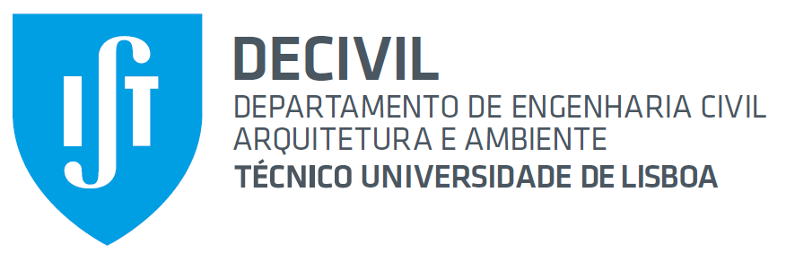

# Safety and Security for Transportation Systems Course

This repository gathers the supporting materials for the [Safety and
Security for Transportation Systems
Course](https://fenix.tecnico.ulisboa.pt/disciplinas/SSTran112/2025-2026/1-semestre)
of the Master’s program of [Transportation
Systems](https://tecnico.ulisboa.pt/en/education/courses/masters-programmes/transportation-systems/)
at **Instituto Superior Técnico - University of Lisbon**, lectured by
[Prof. Luís Picado
Santos](https://fenix.tecnico.ulisboa.pt/homepage/ist25123) and
[Prof. Gabriel
Valença](https://ushift.tecnico.ulisboa.pt/team-gabriel-valenca/).  
This material is also an open source tutorial for applying R programming
for modelling crash frequency and severity models.

**1. Modelling the Frequency of Traffic Accidents**:

- The [Data](Data/GLZM_CALMICH_Example.xlsx) used in class.
- The [Code](Code/GLM_Accident_Frequency.R) for Poisson and Negative
  Binomial models.

**2. Modelling the Severity Levels of Traffic Accidents**:

- The [Data](Data/RTA%20Dataset.csv) used in class.
- The [Code](Code/Severity_OrderedLogitModel_code.R) for Ordered Logit
  Regression models.

> The codes were developed by Prof. Gabriel Valença and are taught
> during the practical lectures.
